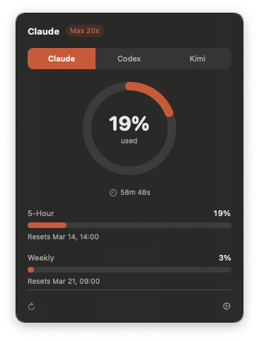
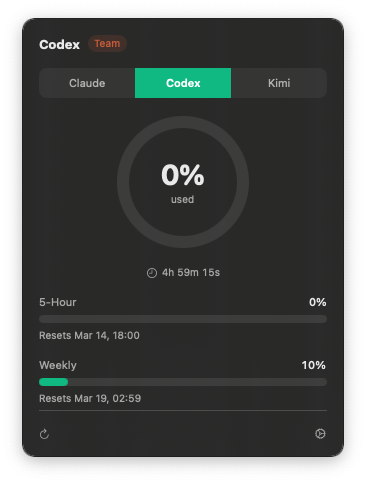
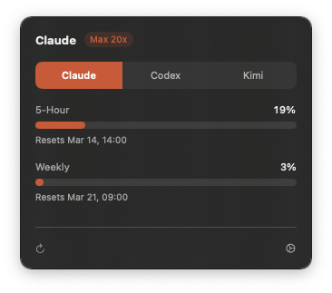
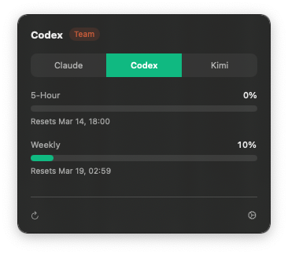
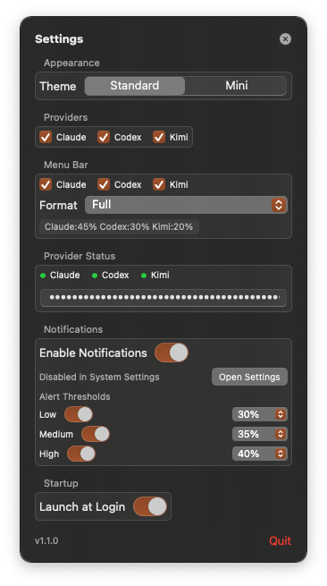
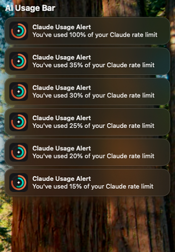

<div>
<h3>AI Usage Bar</h3>
<p>Track your Claude Code and Codex CLI usage limits directly from the macOS menu bar.<br>
See how much of your daily and weekly quota you've used, get notified before hitting limits,
and switch between providers in one click.</p>
</div>

<br clear="all"/>

<div align="center">
<a href="https://github.com/sushi-killer/AIUsageBar/releases"></a>
<a href="https://github.com/sushi-killer/AIUsageBar/blob/main/LICENSE"></a>
<a href="https://github.com/sushi-killer/AIUsageBar/releases"></a>
</div>

## Features

- Real-time Claude Code & Codex CLI usage tracking
- Dual time windows: 5-hour rolling + weekly limits
- Provider-colored usage bars & ring, status-colored tray icon (green / yellow / red)
- Smart notifications at configurable thresholds (50%, 75%, 90%)
- Claude API + local log file fallback
- FSEvents-based file watching (near-zero CPU at idle)
- Menu bar text customization (Short / Full / Percent / Icon Only / Custom)
- Light & Dark mode support
- Launch at Login

## Screenshots

| Claude (Standard) | Codex (Standard) |
|:---:|:---:|
|  |  |

| Claude (Mini) | Codex (Mini) |
|:---:|:---:|
|  |  |

| Settings | Notifications |
|:---:|:---:|
|  |  |

## Installation

### Quick install

```bash
curl -fsSL https://raw.githubusercontent.com/sushi-killer/AIUsageBar/main/install.sh | bash
```

### Manual

1. Download the latest `.zip` from [Releases](https://github.com/sushi-killer/AIUsageBar/releases/latest)
2. Extract and move `AI Usage Bar.app` to `/Applications/`
3. Right-click the app and select **Open** on first launch (ad-hoc signed)

> **Note:** On first launch macOS may show "AI Usage Bar can't be opened because Apple cannot check it for malicious software." Right-click (or Control-click) the app and choose **Open**, then click **Open** in the dialog.

## Usage

AI Usage Bar lives in your menu bar — look for the usage icon in the top-right corner of your screen.

**Relaunch after quitting:**
- Open Spotlight (Cmd+Space) and type "AI Usage Bar", or
- Open `/Applications/AI Usage Bar.app` from Finder

**Tip:** Enable **Launch at Login** in Settings (gear icon) so the app starts automatically with macOS.

## Updating

AI Usage Bar checks for updates automatically. When a new version is available,
you'll see a notification and a link in Settings.

You can also update manually:

```bash
curl -fsSL https://raw.githubusercontent.com/sushi-killer/AIUsageBar/main/install.sh | bash
```

Or download the latest `.zip` from [Releases](https://github.com/sushi-killer/AIUsageBar/releases/latest) and replace the app in `/Applications/`.

## Setup

### Claude Code

**Automatic** — AI Usage Bar reads credentials from the macOS Keychain, which are set by the Claude Code CLI. Just make sure Claude Code is installed and you have logged in at least once.

### Codex CLI

**Automatic** — reads your Codex credentials from `~/.codex/auth.json` and fetches usage via the OpenAI API, with local session logs (`~/.codex/sessions/`) as fallback. Just make sure Codex CLI is installed and you have logged in at least once.

## Configuration

Open settings from the menu bar icon (gear button):

- **Theme**: Standard (with usage ring) or Mini
- **Menu bar format**: Short, Full, Percent, Icon Only, Custom template
- **Notifications**: per-threshold toggle with percentage picker (50%, 75%, 90%)
- **Launch at Login**: start automatically on macOS login

## Privacy

AI Usage Bar stores no data remotely and includes no analytics, telemetry, or tracking.

- Claude usage is fetched from the official Anthropic API using your local Keychain credentials
- Codex usage is fetched from the OpenAI API using your local Codex credentials (`~/.codex/auth.json`), with local session logs as fallback
- Your credentials never leave your machine — they are read locally and sent only to the respective provider APIs (api.anthropic.com, chatgpt.com)

## Requirements

- macOS 13.0 Ventura or later
- At least one of:
  - [Claude Code CLI](https://docs.anthropic.com/en/docs/claude-code) — logged in at least once
  - [Codex CLI](https://github.com/openai/codex) — used at least once

## Troubleshooting

| Problem | Solution |
|---------|----------|
| Claude shows "Start using Claude to see usage" | Make sure Claude Code CLI is installed and you've logged in (`claude` in terminal) |
| Codex shows no data | Make sure Codex CLI is installed and you've logged in (`codex` in terminal) |
| Keychain access dialog on every launch | Click **Always Allow** instead of **Allow** |
| Menu bar icon not visible | Check System Settings → Control Center → menu bar overflow |
| Notifications not appearing | System Settings → Notifications → AI Usage Bar → enable |
| Quit the app and can't find it | Spotlight (Cmd+Space) → "AI Usage Bar", or open from `/Applications/` |
| Want it to start automatically | Settings → enable **Launch at Login** |

## Building from Source

Requires Xcode 15+ with Swift 5.9.

```bash
git clone https://github.com/sushi-killer/AIUsageBar.git
cd AIUsageBar
xcodebuild -scheme AIUsageBar -configuration Release build
```

The built app will be in Xcode's DerivedData directory.

## Tech Stack

SwiftUI, AppKit, Security (Keychain Services), FSEvents, UserNotifications, ServiceManagement

## Uninstall

1. Quit AI Usage Bar (click the menu bar icon → **Quit**)
2. Delete `/Applications/AI Usage Bar.app`
3. Optionally remove preferences: `defaults delete com.aiusagebar.app`

## License

GPL-3.0 — see [LICENSE](LICENSE)

## Contributing

See [CONTRIBUTING.md](CONTRIBUTING.md)
